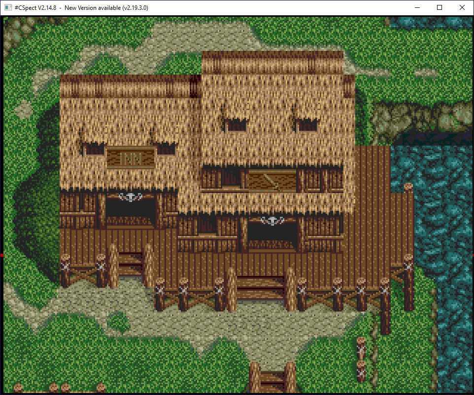

# Layer2 Tilemap Demo

Example using Layer2 tilemap rendering for the ZX Spectrum Next.

## Controls
Use WASD keys to scroll tilemap

## Settings

Edit configure.m4 to change various settings:

|Setting|Description|
|---|---|
|SCREEN_RES|Screen resolution: RES_256x192 or RES_320x256|
|USE_ASM_VERSION|Use the assembly or C version|
|ALIGN_MOD_LUT|Use align version for mod LUTs|
|MAP_Y_FIRST|Use tile y first order|
|CRT_6000|Set CRT location as 0x6000 or 0x8000|

## How to Build

If you want to build the zxnext_layer2_tilemap program yourself, follow the steps below:

1. Install the latest version of [z88dk](https://github.com/z88dk/z88dk) and
a Sinclair ZX Spectrum emulator [CSpect](https://dailly.blogspot.com/) or
[ZEsarUX](https://sourceforge.net/projects/zesarux/).

2. Download the zxnext_layer2_tilemap repository either as a ZIP archive using the
"Clone or download" button at the top of this page or with Git using the
following command:

> git clone https://github.com/benbaker76/zxnext_layer2_tilemap.git

3. Go to the zxnext_layer2_tilemap directory and enter the following command:

> make

4. Run the zxnext_layer2_tilemap/bin/zxnext_layer2_tilemap.nex file in your
Sinclair ZX Spectrum emulator.

## Screenshot

## Thanks

- [Michael Ware](https://www.rustypixels.uk/) for innumerable help with the Next hardware, z80 asm and optimizations
- [Sefan Bylund](https://github.com/stefanbylund) for his z88dk examples on which these are based
- [Peter Ped Helcmanovsky](https://github.com/ped7g) for help and optimizations
- [Allan Albright](https://github.com/aralbrec) for help with z88dk

## License

This software is licensed under the terms of the MIT license.
